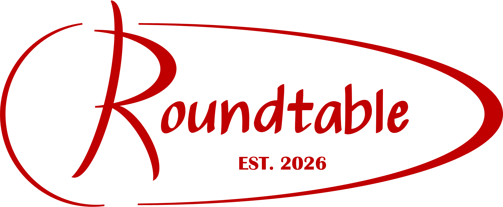
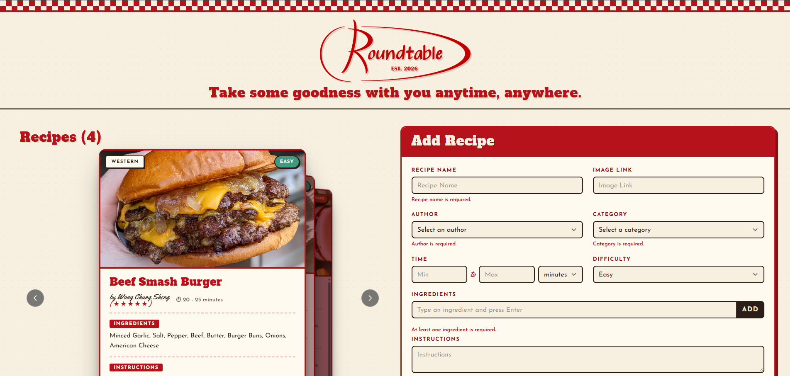

# 

A project built to let people store their own favourite recipes.

Features include:
- Forms to add new authors or recipes
- Attractive layout to view recipes and its details

Built with:
- JavaScript (ES6)
- React
- HTML
- CSS
- Bootstrap
- Depth Carousel from React Bits (https://reactbits.dev/components/depth-carousel)

## Links
- Railway link: https://roundtable-frontend-production.up.railway.app/